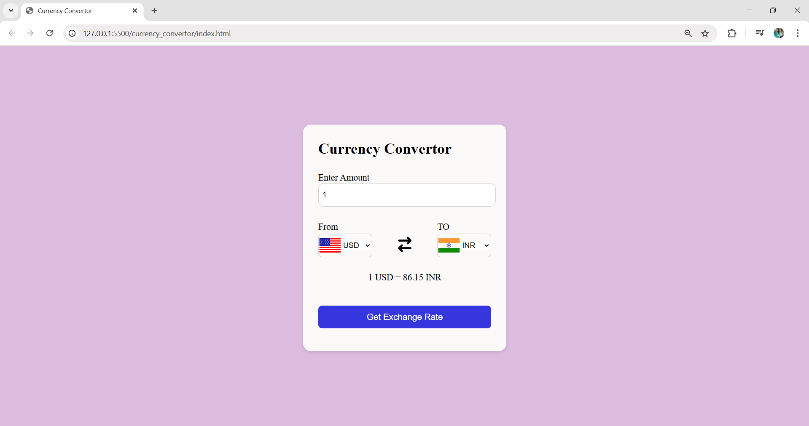
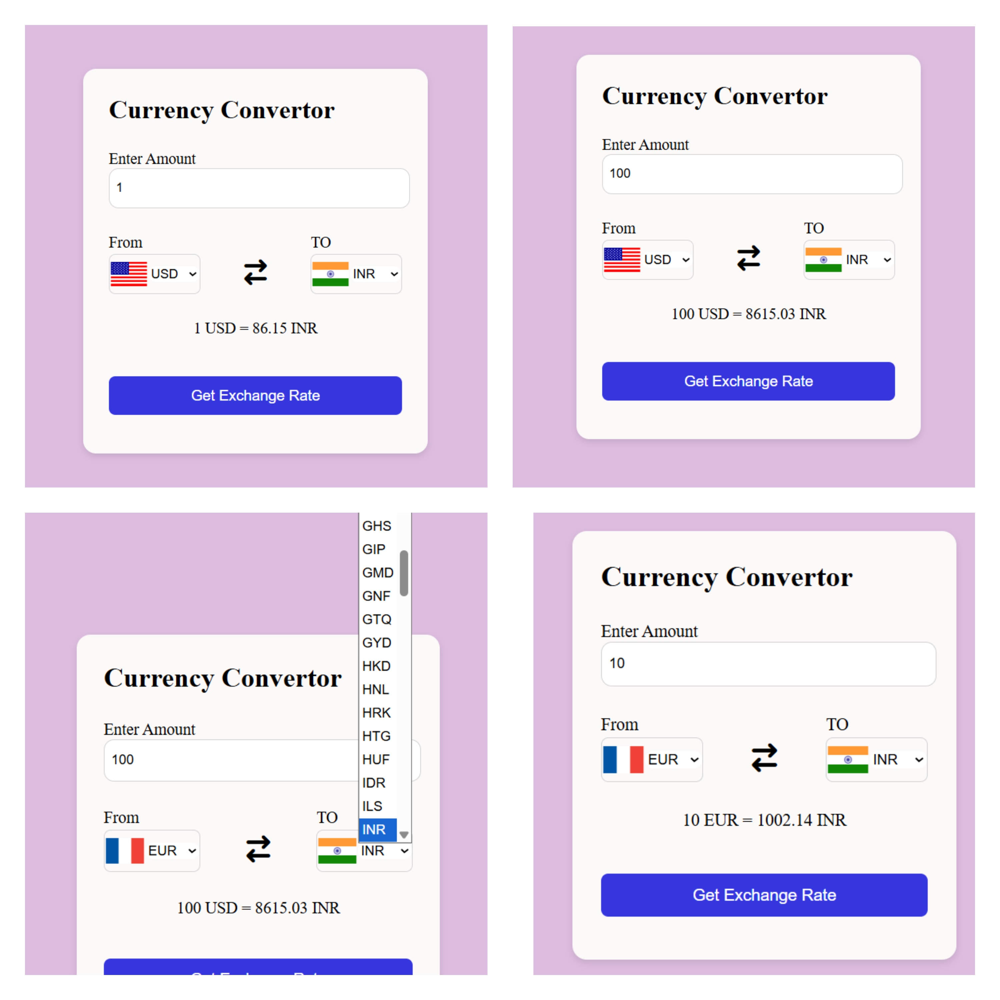

# 🎮 JavaScript Projects – Rock Paper Scissors & Currency Converter

Learning-by-building! These are fun and practical JavaScript projects I created while learning **DOM manipulation**, **game logic**, and **API integration**.

---

## ✊ Rock Paper Scissors Game

A simple and interactive Rock-Paper-Scissors game built using **HTML, CSS, and JavaScript**. Challenge the computer and test your luck!

🔗 **Live Demo:** [Play the Game](https://maithili2004.github.io/stone-paper-scissor/)


### 🚀 Features
- Choose between Rock, Paper, or Scissors
- Computer randomly selects its move
- Winner decided based on rules
- Live score tracking
- “Start a new Game” resets the match

---

## 💱 Currency Converter

A responsive **currency converter** that uses **real-time exchange rates** via API fetch. Enter the amount, choose currencies, and get instant results.

🔗 **Live Demo:** [Try the Converter](https://maithili2004.github.io/stone-paper-scissor/currency_convertor/)




### 🌐 Features
- Converts between multiple global currencies
- Fetches real-time data from an API
- Fully responsive layout
- Simple and user-friendly UI

---

## 🛠️ Tech Stack (Both Projects)

- **HTML5** – Page structure  
- **CSS3** – Styling and layout  
- **JavaScript** – Game logic & API handling  
- **Fetch API** – For real-time currency data

---

## 📁 How to Run Locally

```bash
git clone https://github.com/Maithili2004/stone-paper-scissor.git
cd stone-paper-scissor
# Open index.html in the root folder or currency_convertor/index.html in browser

---

## 👩‍💻 Developer

**Maithili Chavan**  
Final Year Student – B.E. Information Technology  
[GitHub](https://github.com/Maithili2004) | [LinkedIn](https://www.linkedin.com/in/maithilichavan24/)
