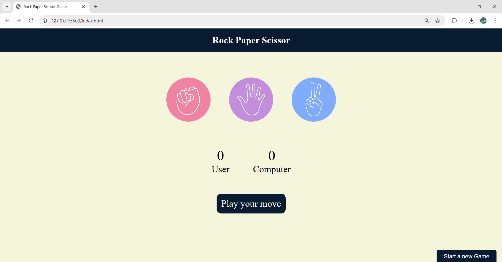

# 🎮 Rock Paper Scissors Game

A simple and fun Rock-Paper-Scissors game built using **HTML, CSS, and JavaScript**. Challenge the computer, test your luck, and enjoy the game!



## 🚀 Features

- ✊ ✋ ✌️ Choose between Rock, Paper, or Scissors.
- 💻 Computer randomly selects its move.
- 🧠 Game logic determines round winner.
- 📊 Scores are updated live for both User and Computer.
- 🔁 “Start a new Game” resets the game easily.

## 🛠️ Tech Stack

- **HTML5** – For page structure
- **CSS3** – For styling and layout
- **Vanilla JavaScript** – For interactivity and game logic

## 📁 How to Run Locally

1. Clone the repository or download the ZIP.
2. Open `index.html` in your browser.
3. Start playing and have fun!

```bash
git clone https://github.com/your-username/rock-paper-scissors.git
cd rock-paper-scissors
open index.html  # Or double-click to open in browser

## 🎯 Game Rules

- Rock beats Scissors
- Scissors beats Paper
- Paper beats Rock

---

## 👩‍💻 Developer

**Maithili Chavan**  
Final Year Student – B.E. Information Technology  
[GitHub](https://github.com/Maithili2004) | [LinkedIn](https://www.linkedin.com/in/maithilichavan24/)